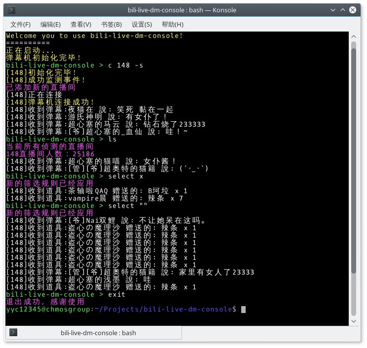

# bili-live-dm-console
A cross-platform bilibili live danmaku console receiver.  

Inspired and getting some core code from [copyliu/bililive_dm](https://github.com/copyliu/bililive_dm)
True Room id detector's code is come from [zyzsdy/biliroku](https://github.com/zyzsdy/biliroku)

## Install
### Windows
Go to [Microsoft dotnet website](http://www.microsoft.com/net/download) to get a binary file to install dotnet **SDK** environment.  

### Linux and macOS
Follow the step from this [website](http://www.microsoft.com/net/download) to install dotnet **SDK** environment.  

>This application need dotnet 2.0 or above SDK.  

## Usage
### Initialize
```
git clone https://github.com/yyc12345/bili-live-dm-console.git
dotnet restore

dotnet run -- [-nr] [-debug]
```

-nr also is a optional parameter. By sign it, you can disable the function of recording danmaku into file.  
-debug is a optional parameter for developer. Signing it will make application show more information during running.  
### Internal command
You can press tab to get a command inputer.  

```
bili-live-dm-console > ls

bili-live-dm-console > select EXPRESS [-re]

bili-live-dm-console > c ROOM_ID [-s]
bili-live-dm-console > connect ROOM_ID [-s]

bili-live-dm-console > dc ROOM_ID
bili-live-dm-console > disconnect ROOM_ID

bili-live-dm-console > exit

```
>If you input nothing or input a wrong command. This application will remind you.  

#### ls
ls will list all live room which you connect and also show it's the number of viewer.  

#### select
select will provide a way to filter your received danmaku.  
If you want use regular express, please use -re switch.  
If you want to cancel this function, please specified String.Empty. but it not mean you need to input ```select```. You must input ```select ""``` to do this.  

#### c/connect
connect will connect to a live room and get all of it's danmaku.
ROOM\_ID is bilibili live room's id. It must be a number. Some room id is equal with url id but some not.  
-s is a optional parameter. If you sign it, it mean that application need to search actual room id and you must make sure your ROOM\_ID parameter is url id.  

#### dc/disconnect
disconnect just like it's name.  
Please ensure ROOM\_ID is what you use to connect the live room which you want to cancel now.  

#### exit
exit will make you exit this application naturally.  
Except some special situation. Using this command to exit is the best way.  

## Screenshot
Debian 9.1/KDE  

